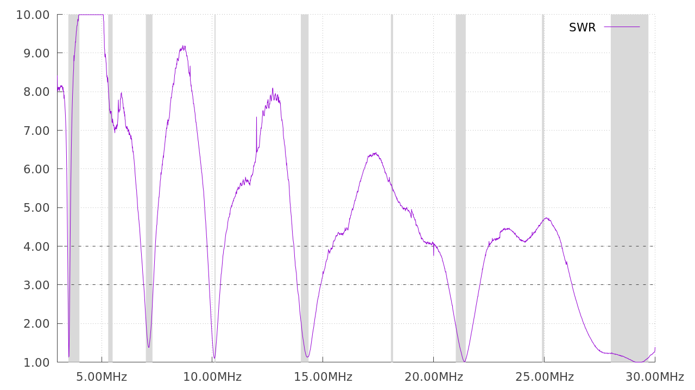

## swr

Is a program for driving the EA4FRB SARK100 antenna analyzer (also sold as the
LXQQFY MR300 or KKmoon MR300) and making pretty graphs.

## To run

* Make sure `gnuplot` is installed.
* Connect the meter, put it in PC Link mode, and find out what port it's on.
* Run `swr --port /dev/whatever --start 14000 --end 15000`
* Look at `swr.png`.

(There are many more options, run `swr --help` to see them).

## To build

(Only needed if you modify the source, or want to build against new versions of
 upstream dependencies):

`./fatpack`
